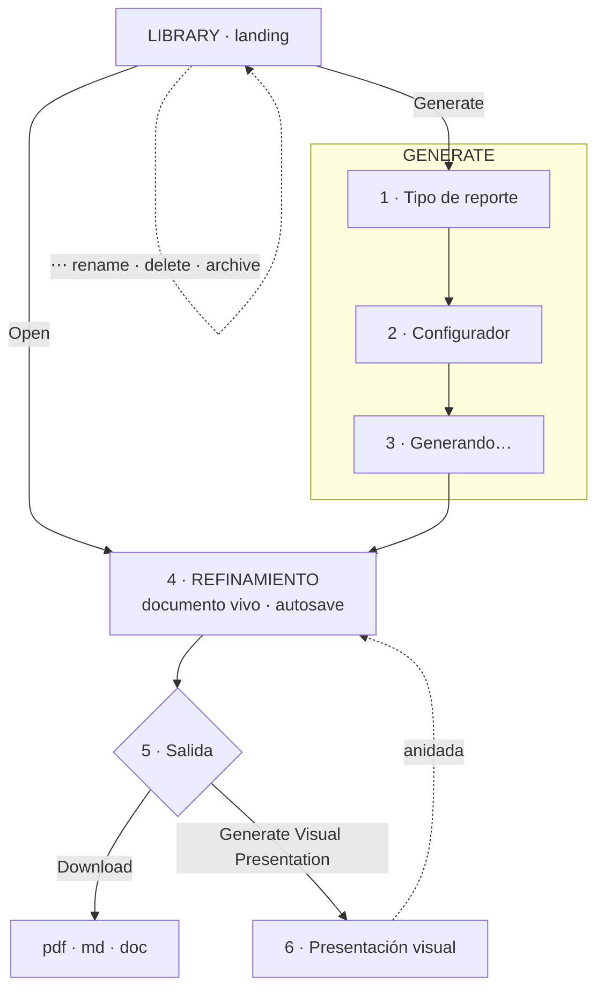

# Report v2 — flujo y brief de diseño

_Base: tus indicaciones (2026-07-23), los acuerdos de junio y el handoff IT 3._
_**Estado: para diseñar antes de programar.** Documento dirigido a Claude Design._

---

## 0. El modelo en una frase

> **Report es el centro de acción del analista.** Toma casos de Creative Source, los convierte en un estudio de texto profundo, y ese estudio **puede anidar su propia versión visual**. Showcase deja de ser un módulo.

---

## 1. Decisiones cerradas

| Tema | Decisión |
|---|---|
| **Contenido** | El reporte se guarda **por bloques con id estable**, no como un blob de texto. Es el prerrequisito de los comentarios anclados y la regeneración por sección |
| **Generación** | **Por secciones, con guardado incremental.** No una única llamada bloqueante |
| **Suggested** | Por objetivo de proyecto. Selector de objetivos en **Settings**, con **la misma lista que el onboarding** |
| **Weighting** | **Se retira el control del configurador.** El motor se conserva y el criterio queda atado a la familia del informe |
| **Showcase** | Los showcases existentes se **archivan**. El módulo sale del sidebar |

---

## 2. Mapa del flujo

---

## 3. Inventario de pantallas

### P1 · Library *(landing)*
**Ya diseñada en el handoff IT 3.** Se mantiene wireframe y funcionalidad.

**Falta diseñar:**
- **Modal Rename** — título actual precargado, Cancel / Rename.
- **Modal Delete** — confirmación. *Borrado suave: un reporte puede llevar presentación y comentarios colgando.*
- **Indicador de presentación anidada** en la fila. Los reportes ya no son solo texto y debe verse sin abrirlos. Sugerencia: un icono discreto junto a la burbuja de comentarios.

**Estados que faltan por diseñar:** biblioteca vacía (proyecto nuevo, cero reportes) y fila de reporte cuya generación falló a medias.

---

### P2 · Generate — paso 1: tipo de reporte
Dos bloques: **Suggested** (uno por objetivo del proyecto) y **Others**.

**Dato real que el diseñador necesita — los 7 objetivos del onboarding:**
1. Competitive positioning & messaging
2. Identify white spaces / opportunities
3. Creative inspiration & benchmarking
4. Innovation scan
5. Brand consistency audit
6. Category landscape map
7. Tone & territory analysis

**Y los 3 motores que existen hoy:** Strategic Positioning (flagship) · Social Content Benchmark · Global Creative Inspiration.

> ⚠️ **Hueco de producto que hay que resolver ANTES de diseñar esta pantalla.** La lista no cuadra en ninguna de las dos direcciones:
> - **Objetivos sin informe**: *Innovation scan* y *Tone & territory analysis* no tienen motor.
> - **Informe sin objetivo**: *Social Content Benchmark* **no corresponde a ningún objetivo de la lista** — no hay ningún objetivo social.
> - Tres objetivos (*white spaces*, *brand consistency*, *category landscape*) son en realidad **secciones extraíbles del flagship**, no informes distintos. Eso era justo lo previsto en junio.
>
> Sin cerrar este mapeo, "un suggested por objetivo" no se puede diseñar: no se sabe cuántas tarjetas hay ni qué dicen. Ver §6.

**Diseñar:** tarjeta de tipo de informe (título, descripción, chip Flagship/Core), estado sin objetivos definidos (proyecto sin onboarding completo) y el enlace a Settings para definirlos.

---

### P3 · Generate — paso 2: configurador
Tres bloques.

**Source** — de dónde salen los casos. Tres modos excluyentes:

| Modo | El usuario elige | Nota para diseño |
|---|---|---|
| **By brand** | una o varias marcas | Lista viene del proyecto |
| **By audit** | `local` · `global` · **both** | Tres opciones fijas |
| **By collection** | una colección de Creative Source | Puede no haber ninguna → estado vacío |

*Los tres desembocan en un mismo conjunto de casos. Conviene que la pantalla muestre **cuántos casos ha resuelto la selección** ("84 casos"), porque es la única señal de que el informe tendrá material suficiente.*

**Lens** — `Brand` · `Agency` · `VC`. Cambia encuadre y ángulo de recomendaciones, no el análisis.

**Configure** — se queda con **Timeframe**, **Communication intents** y **Sections**.
Fuera: ~~Weighting~~ (ahora automático), ~~Brands~~ (ya está en Source), ~~Custom instructions~~.

**Pendiente de decidir para diseño:** si **Sections** conserva el campo de instrucción por sección que se acordó en junio, o queda solo en incluir/excluir/reordenar. Cambia bastante la pantalla.

---

### P4 · Generando
Overlay con progreso. **Importante para el diseño: la generación es por secciones**, así que el progreso puede ser real ("3 de 6 secciones"), no una barra falsa. Merece diseñarse como tal.

**Diseñar también:** el fallo a mitad — qué ve el analista si la sección 4 de 6 revienta. Hay contenido válido que no se debe tirar.

---

### P5 · Refinamiento *(el documento)*
Cuatro herramientas, ya diseñadas en el handoff IT 3:

| Herramienta | Dónde aparece |
|---|---|
| **Ask about this** | al seleccionar texto |
| **Comment** | al seleccionar texto |
| **Regenerate** | junto a cada sección |
| **Edit** (+ insertar casos con `@`) | botón superior |

**Autosave** mientras el analista trabaja.

**Falta diseñar:** indicador de guardado (guardando / guardado / error), y el aviso si otro analista tocó el documento por debajo.

---

### P6 · Salida
- **Download**: `pdf` · `md` · `doc`.
- **Generate Visual Presentation**.

**Falta diseñar:** el paso de generar la presentación (¿pregunta algo antes?) y cómo se accede a ella una vez existe — dentro del reporte, no en el sidebar.

---

## 4. Lo que sale de la navegación

**Showcase desaparece del sidebar.** N1 pasa a: Creative Source · Scout · Intelligence · Report.
Los showcases existentes quedan **archivados**. Merece un aviso de una línea en la UI para quien los tuviera guardados.

---

## 5. Restricciones de diseño

Ya establecidas y en producción — el diseñador debe partir de aquí, no reinventarlas:

- **Acento único ember.** Nunca azul, violeta ni verde.
- **Cabecera compartida**: título a la izquierda, etiqueta de módulo en mono a la derecha, N2 como pill blanco segmentado.
- **Contenedor 1180 / 34px**, igual que Creative Source, Intelligence y Scout.
- **Tipos**: Klamp 105 Mono (display) · IBM Plex Mono (UI/labels) · IBM Plex Sans (cuerpo).
- **Estado activo**: pill relleno ink-800 para navegación; ember para marcas de dato.
- Radios 8–9 (controles) → 12 (filas) → 14 (cards) → 16 (documento).

---

## 6. Lo que hay que resolver antes de diseñar

1. **El mapeo objetivo → informe** (§P2). Es el bloqueo real. Tres caminos:
   - (a) Reducir la lista de objetivos a los que tienen motor.
   - (b) Añadir un objetivo social y generar los que faltan como secciones extraíbles del flagship.
   - (c) Que un objetivo pueda sugerir una **sección** del flagship, no solo un informe entero.
   *Recomiendo (c) + añadir el objetivo social: encaja con lo acordado en junio ("las secciones son extraíbles como sub-informes") y no fragmenta el catálogo.*

2. **Sections con o sin prompt por sección** (§P3).

3. **Comentarios: ¿solo K&D o también cliente?** Define si hace falta distinguir autores visualmente y qué permisos aplican.

---

## 7. Orden de construcción *(después del diseño)*

**F0** Migraciones + contenido por bloques con id · **F1** Library + rename/delete · **F2** Generate 1 y 2 · **F3** Generación por secciones con guardado incremental · **F4** Refinamiento · **F5** Download · **F6** Presentación anidada y salida de Showcase del sidebar.
