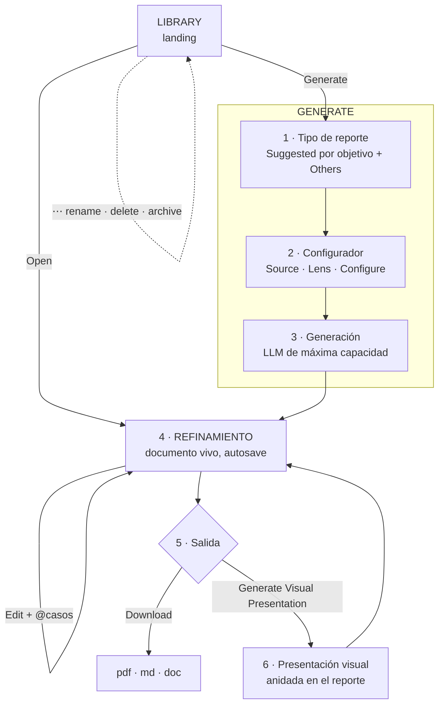

# Report v2 — diseño de flujo

_Diseñado sobre tus indicaciones (2026-07-23), los acuerdos de junio y el handoff IT 3._
_Sustituye a `SPEC_report-redesign.md` como plan vigente._

---

## 0. El modelo en una frase

> **Report es el centro de acción del analista.** Toma casos de Creative Source, los convierte en un estudio de texto profundo, y ese estudio **puede anidar su propia versión visual**. Showcase deja de ser un módulo.

---

## 1. Mapa del flujo

---

## 2. LIBRARY — el landing

Se mantiene el wireframe y las funcionalidades actuales, **más dos ventanas que faltaban**:

- **Rename** — modal con el título actual precargado.
- **Delete** — modal de confirmación. *Decisión técnica: borrado suave (`deleted_at`) en vez de duro, porque un reporte puede tener presentación anidada y comentarios colgando; un `DELETE` en cascada es irreversible y aquí el coste de equivocarse es alto.*

Cada fila muestra además si el reporte **tiene presentación visual** (los reportes ya no son solo texto, y eso hay que poder verlo sin abrirlos).

---

## 3. GENERATE

### 3.1 Paso 1 — Tipo de reporte

- **Suggested**: **uno por cada objetivo** definido en el onboarding/settings del proyecto. Si el proyecto tiene tres objetivos, se sugieren tres.
- **Others**: el resto de nuestros reportes signature.

> ⚠️ **Dependencia dura**: los objetivos del proyecto se definen en el **onboarding configurador**, que es el pendiente de junio y **no está construido**. Sin él no hay "suggested por objetivo". Ver §7.

### 3.2 Paso 2 — Configurador

**Source** — de dónde salen los casos. Tres modos, correspondientes a las categorizaciones de Creative Source:

| Modo | Resuelve a |
|---|---|
| **By brand** | entradas cuyo `brand_name`/`competitor` esté en la selección |
| **By audit** | `scope = local` \| `global` \| **both** |
| **By collection** | miembros de una colección de CS (`collections` + `collection_entries`) |

*Nota técnica: las tres se resuelven a **un mismo conjunto de entradas**. Conviene un único resolvedor `resolveSource({mode, value}) → entries[]` para que las tres rutas de generación compartan camino y no se dupliquen filtros.*

**Lens** — `agency` · `brand` · `vc`. Cambia encuadre ejecutivo, ángulo de recomendaciones y énfasis (secciones 1 y 6 sobre todo). No cambia el análisis base.

**Configure** — se queda con:
- **Timeframe**
- **Communication intents**
- **Sections** (incluir/excluir, reordenar)

Y **desaparecen**:
- ~~Weighting~~ — ver aviso abajo.
- ~~Brands~~ — ya se define en Source.
- ~~Custom instructions~~

> ⚠️ **Aviso importante sobre "se va weighting".** Entiendo que se retira **el control de la interfaz**, no el motor. El motor de pesos (fuente × intención, por sección, con sus tres modos) es el IP central acordado en junio y es lo que hace que cada informe se concentre en lo que importa. Mi lectura: **el modo se autoselecciona según la familia del reporte** — flagship → brand-signal · social benchmark → performance · global inspiration → quality — y el analista deja de elegirlo. Si lo que quieres es retirar también el motor, dímelo explícitamente, porque es una decisión de producto muy distinta.

### 3.3 Paso 3 — Generación

Usa **el modelo más capaz disponible** para un análisis profundo con todo el input del paso 2.

*Consideraciones técnicas:*
- Un análisis profundo sobre un corpus grande **no cabe en una petición HTTP normal** (límite de función serverless en Vercel). Necesita **generación por secciones o trabajo en segundo plano con progreso**, no una única llamada bloqueante.
- Conviene **fijar el modelo en un solo sitio** (constante compartida) y no repetirlo en cada ruta, para que "el más avanzado disponible" se actualice en un cambio.
- La generación debe **persistir en cuanto termina cada sección**, no solo al final: si algo falla a mitad, no se pierde lo generado.

---

## 4. REFINAMIENTO — cuatro herramientas

El documento nace vivo y **se auto-guarda mientras el analista trabaja**.

**Al seleccionar texto:**
1. **Ask about this** — pregunta puntual a la IA sobre ese fragmento.
2. **Comment** — comentario sobre la selección; colaboración entre analistas.

**Junto a cada párrafo/sección:**
3. **Regenerate** — regenera la sección a partir de un prompt.

**Arriba:**
4. **Edit** — ajustes directos sobre el texto + insertar casos con `@`.

*Consideraciones técnicas:*
- **Anclaje de comentarios**: no por coincidencia de texto (el propio handoff lo avisa). Cada bloque necesita **id estable**, y el comentario guarda `bloque + offsets`. Si el analista edita el texto, un comentario anclado por string se pierde o salta de sitio.
- **Autosave + comentarios + regeneración** conviven sobre el mismo documento: hace falta que el contenido esté **estructurado por bloques con id**, no como un blob HTML. Es la decisión estructural más importante de esta fase.
- **Autosave con dos analistas a la vez**: hoy no hay control de concurrencia. Como mínimo, guardar `updated_at` y avisar si el documento cambió por debajo.

---

## 5. SALIDA

- **Download**: `pdf` · `md` · `doc`.
- **Generate Visual Presentation**: genera la versión visual (lo que hoy es Showcase).

---

## 6. La presentación visual se anida en el reporte

**Este es el cambio de arquitectura fuerte.** Showcase deja de ser un módulo del sidebar y pasa a ser **una salida del reporte**.

Estado actual: `app/showcase/page.jsx` son **2.586 líneas** y guarda en la tabla **`saved_showcases`**.

*Consideraciones técnicas:*
- El **motor de presentación se conserva** (es mucho trabajo hecho); lo que cambia es **dónde se entra a él y de quién cuelga**.
- `saved_showcases` necesita `report_id` para colgar del reporte. Los showcases existentes se quedarían **huérfanos**: hay que decidir si se migran a un reporte contenedor, si se conservan accesibles en modo lectura, o si se archivan.
- El módulo **sale del sidebar**, lo que cambia la navegación N1 para todos.

---

## 7. Dependencias y bloqueos

| Necesita | Estado | Impacto |
|---|---|---|
| Objetivos de proyecto (onboarding configurador) | ❌ **No construido** (pendiente desde junio) | Sin esto, "Suggested por objetivo" no puede existir. **Es el bloqueo principal del paso 1** |
| `collections` + `collection_entries` | ✅ Existen | "By collection" es viable ya |
| Motor de pesos, lente ICP, 3 informes core | ✅ Construidos | Se reutilizan |
| `status`, `archived`, `deleted_at` en `saved_reports` | ❌ No existen | Migración |
| Tabla de comentarios con anclaje estable | ❌ No existe | Migración |
| `report_id` en `saved_showcases` | ❌ No existe | Migración |
| Contenido por bloques con id | ❌ Hoy es texto/HTML | **Prerrequisito** de comentarios y regeneración fiable |

---

## 8. Decisiones que necesito antes de construir

1. **Weighting**: ¿se retira solo el control de UI (motor sigue, modo automático por familia) o se retira el motor? *(Recomiendo lo primero.)*
2. **Suggested sin onboarding**: mientras no exista el configurador de objetivos, ¿qué hacemos? Opciones: (a) construir primero un selector de objetivos mínimo en Settings del proyecto; (b) sugerir por defecto el flagship y marcar el resto como Others. *(Recomiendo (a): es poco trabajo y desbloquea el paso 1 tal como lo diseñaste.)*
3. **Showcases existentes**: ¿se migran a reportes contenedores, se dejan en solo-lectura, o se archivan?
4. **Sections**: ¿mantienen el prompt por sección que se acordó en junio, o solo incluir/excluir y reordenar? *(Tu lista de Configure no lo menciona.)*
5. **Comentarios**: ¿solo analistas K&D, o también el cliente? Define permisos y RLS.

---

## 9. Orden de construcción propuesto

**F0** — Migraciones + **contenido por bloques con id** (prerrequisito silencioso de todo lo demás).
**F1** — Library sobre el shell + rename/delete + estados.
**F2** — Generate paso 1 y 2 (tipo + configurador con Source/Lens/Configure).
**F3** — Generación por secciones con persistencia incremental.
**F4** — Refinamiento (las 4 herramientas + autosave).
**F5** — Download.
**F6** — Anidar la presentación visual y sacar Showcase del sidebar.

*F0 primero no es burocracia: sin bloques con id, los comentarios y la regeneración por sección se construyen sobre arena.*
